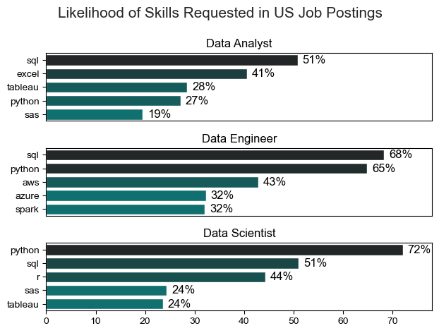
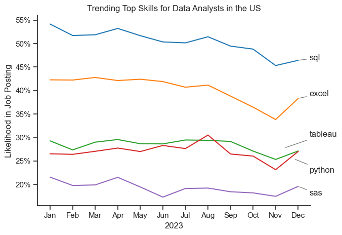
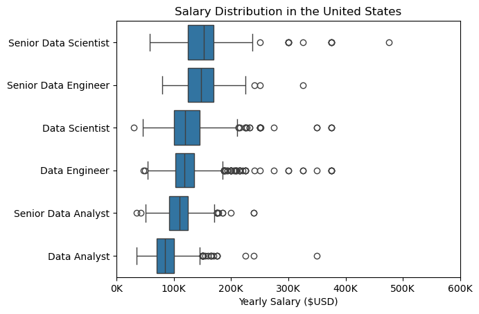
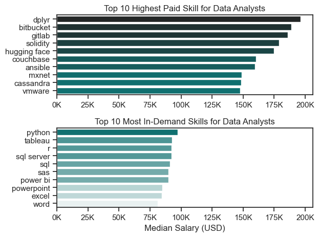
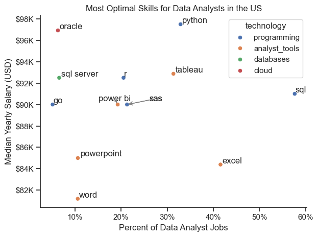

# The Analysis

## 1. What are the most demanded skills for the top 3 most popular data roles?

I started by filtering the data for US based jobs only. I found the most demanded skills for the top 3 most popular data roles. I filtered out those positions by the most popular, and got the top 5 skills for each of these top 3 roles. This query highlights the 3 most popular job titles and their associated top 5 skills, showing which skills are most requested by companies for top data roles.

View my notebook with detailed steps here:  
[2_Skill_Demand.ipynb](3_Project/2_Skill_Demand.ipynb)

### Visualize the Data

```python
fig, ax = plt.subplots(len(job_titles), 1)

sns.set_theme(style='ticks')

for i, job_title in enumerate(job_titles):
    df_plot = df_skills_perc[df_skills_perc['job_title_short'] == job_title].head(5)

    sns.barplot(data=df_plot, x='skill_percent', y='job_skills', ax=ax[i], hue='skill_count', palette='dark:teal_r')
    ax[i].set_ylabel('')
    ax[i].set_xlabel('')
    ax[i].set_title(job_title)
    ax[i].set_xlim(0, 78)
    ax[i].legend().set_visible(False)
    
    for n, v in enumerate(df_plot['skill_percent']):
        ax[i].text(v + 1, n, f'{v:.0f}%', color='black', va='center')

    if i != len(job_titles) - 1:
        ax[i].set_xticks([])

fig.suptitle('Likelihood of Skills Requested in US Job Postings',fontsize=15)
fig.tight_layout()
plt.show()
```

### Results

 
*Bar Graph Showing the Top 5 In Demand Skills for Data Analyst, Data Engineer, and Data Scientist in the US in 2023.*

### Insights

- Python is a versaltile skill, highly demanded across all three roles, but most prominently for Data Scientists (72%) and Data Engineers (65%). 
- SQL is the most requested skill for Data Analysts and Data Scientists, with it in over half the job postings for both roles. For Data Engineers SQl is the most sought after skill appearing in 68% of Job Postings.
- Data Engineers require more specialized skills (AWS, Azure, SPark). Data Analysts need general business tools like Excel, and visualization in Tableau. Data Scientists roles are looking for Python, SQL, and R for more programming based analysis. 


## 2. How are in-demand skills trending for data analysts?

I started by filtering the data for data analyst jobs in the United States. I created a new column for the month in order to breakdown the skill demand by month. I then needed to explode the individual skills per job posting for analysis. I created a pivot table that was sorted by skill count per month, and also created the totals in order to sort by those totals, and creat percentage based values for analysis. I then charted the 5 most in demand skills by their posting percentage throughout 2023.

View my notebook with detailed steps here:  
[3_Skills_Trend.ipynb](3_Project/3_Skills_Trend.ipynb)

### Filter/Sort/Format the Data

```python

df_DA_US = df[(df['job_title_short'] == 'Data Analyst') & (df['job_country'] == 'United States')].copy()

df_DA_US['job_posted_month_no'] = df_DA_US['job_posted_date'].dt.month

df_DA_US_explode = df_DA_US.explode('job_skills')

df_DA_US_pivot = df_DA_US_explode.pivot_table(index='job_posted_month_no', columns='job_skills', aggfunc='size', fill_value=0)

df_DA_US_pivot.loc['Total'] = df_DA_US_pivot.sum()

df_DA_US_pivot = df_DA_US_pivot[df_DA_US_pivot.loc['Total'].sort_values(ascending=False).index]

df_DA_US_pivot = df_DA_US_pivot.drop('Total')

DA_totals = df_DA_US.groupby('job_posted_month_no').size()

df_DA_US_percent = df_DA_US_pivot.div(DA_totals/100, axis=0)

#Change month number to month name
df_DA_US_percent = df_DA_US_percent.reset_index()
df_DA_US_percent['job_posted_month'] = df_DA_US_percent['job_posted_month_no'].apply(lambda x: pd.to_datetime(str(x), format='%m').strftime('%b'))
df_DA_US_percent = df_DA_US_percent.set_index('job_posted_month')
df_DA_US_percent = df_DA_US_percent.drop(columns='job_posted_month_no')

df_DA_US_percent

```

### Results


*Line Graph Visualizing the Trending Top Skills for Data Analysts in the US in 2023*

### Insights:

* SQL maintains its highest demand throughout the year, but does show some decline in importance This reflects it is an essential skill and it's high demand in Data Analyst roles.
* Excel shows it's stability in the second in-demand skill. This shows the continuing relavance for quick data manipulations for Data Analyst roles, despite more advanced tools.
* Tableau and Python show their similar demands in Data Analyst roles.  This shows data visualization and programming skills are essential but secondary to SQL querying skills. Python shows an increase in demand thorughout 2023.


## 3. How well do jobs and skills pay for data analysts?

### Salary Anaysis for Data Roles
I filtered the data for US based roles. I dropped any non values for annual salary from the datset. I found the 6 most in demand roles and plotted their median salaries in a boxplot.

### Visualize the Data

```python

sns.boxplot(data=df_US_top6, x='salary_year_avg', y='job_title_short', order=job_order)

plt.title('Salary Distribution in the United States')
plt.xlabel('Yearly Salary ($USD)')
plt.ylabel('')

ax= plt.gca()
ax.xaxis.set_major_formatter(plt.FuncFormatter(lambda x, _: f'{int(x/1000)}K'))
plt.xlim(0, 600_000)
plt.show()

```

### Results


*Box Plot Showing the Distribution of Salary for Data Roles in The United States 2023*

### Insights:
* Senior Data Scientist and Senior Data Engineer have the highest median salaries. These roles also have the widest range in salary. All Senior positions pay higher than their standard counterpart.
* Data Scientists and Data Engineers are very comparable in their median salaries. They both higher on avergage than Analysts of any seniority.
* Analysts both Senior and standard offer median salaries near $100K USD, but are lower on average than other roles. More technical roles are higher compensated.


## 4. How well do jobs and skills pay for Data Analysts?

### Investigate Median Salary vs Skill for Data Analysts
I filtered the data for data analysts roles in the US. I dropped any none values for salary, and exploded the skills listed for analysis. I determined the Top 10 paying skills for median annual salary, and also determined the Top 10 in demand skills and their associated median annual salary. I graphed a bar chart showing both of these Top 10 skills together.

### Visualize the Data

```python

fig, ax = plt.subplots(2, 1)

sns.set_theme(style='ticks')

# Top 10 Highest Paid Skill for Data Analysts
sns.barplot(data=df_DA_top_pay, x='median', y=df_DA_top_pay.index, ax=ax[0], hue='median', palette='dark:teal_r')

#df_DA_top_pay[::-1].plot(kind='barh', y='median', ax=ax[0], legend=False)
ax[0].set_title('Top 10 Highest Paid Skill for Data Analysts')
ax[0].set_xlabel('')
ax[0].set_ylabel('')
ax[0].xaxis.set_major_formatter(plt.FuncFormatter(lambda x, _: f'{int(x/1000)}K'))
ax[0].legend().remove()
# Top 10 Most In-Demand Skills for Data Analysts
sns.barplot(data=df_DA_skills, x='median', y=df_DA_skills.index, ax=ax[1], hue='median', palette='light:teal')

#df_DA_skills[::-1].plot(kind='barh', y='median', ax=ax[1], legend=False)
ax[1].set_title('Top 10 Most In-Demand Skills for Data Analysts')
ax[1].set_xlabel('Median Salary (USD)')
ax[1].set_ylabel('')
ax[1].set_xlim(ax[0].get_xlim())
ax[1].xaxis.set_major_formatter(plt.FuncFormatter(lambda x, _: f'{int(x/1000)}K'))
ax[1].legend().remove()
plt.tight_layout()
plt.show()

```
View my notebook with detailed steps for questions 3 & 4 here:  
[4_Salary_Analysis.ipynb](3_Project/4_Salary_Analysis.ipynb)

### Results


*Bar Graph Showing the Top 10 Paid & In-Demand Skills for Data Analysts in the US 2023*

### Insights:
* The highest paid skills are specialized tools and platforms. They offer as mush as twice the median salary for US Data Analysts, but they only appear in a few of the job postings.
* For the Top 10 most in-demand skills, Python is the highest paying in median salary. Tableau and SQL also offer higher pay for US Data Analyst positions. It definitely pays more to learn these programming and visualizations programs.
* The microsoft suite of Powerpoint, Excel and Word are in high demand but do not offer as much salary as the more techincal programs, and languages. It is still good to know these programs as they are among the highest desired skills by Companies.


## 5. What is the most optimal skill to learn for Data Analysts?

I started by importing libraries, loading data, and cleaning the data. I filtered the data for Data Analyst jobs in the United States. I removed any none values from the annual salary data. I exploded the skills for analysis. I found the 12 most in demand skills by percentage. I extracted the technology categories for each skill and merged the datasets into one that could be used for plotting a graph.

### Visualize the Data

```python
from adjustText import adjust_text

#df_plot.plot(kind='scatter', x='skill_percent', y='median_salary')
sns.scatterplot(
    data=df_plot,
    x='skill_percent', 
    y='median_salary', 
    hue='technology'
    )

# Set axis labels, title and legend
plt.title('Most Optimal Skills for Data Analysts in the US')
plt.xlabel('Percent of Data Analyst Jobs')
plt.ylabel('Median Yearly Salary (USD)')


# Prepare texts for AdjustText
texts = []
for i in range(len(df_plot)):
    # Use the 'skill' column instead of index for text annotation
    skill_name = df_plot.loc[i, 'skills']
    x = df_plot.loc[i, 'skill_percent']
    y = df_plot.loc[i, 'median_salary']
    texts.append(plt.annotate(skill_name, (x, y)))

# Adjust text to avoid overlap
adjust_text(
    texts,
    autoalign='xy',  # Allow text to align automatically
    only_move={'points': 'y', 'texts': 'y'},  # Move only in the y-direction
    arrowprops=dict(arrowstyle='->', color='gray', lw=1),  # Optional arrows
    force_text=3.5,  # Increase force for spreading texts
    force_points=2.3  # Prevent text from colliding with points
)

# Layout adjustments
sns.despine()
sns.set_theme(style='ticks')
plt.tight_layout()

# Format y-axis as currency and x-axis as percentage
ax=plt.gca()
ax.yaxis.set_major_formatter(plt.FuncFormatter(lambda y, pos: f'${int(y/1000)}K'))
ax.xaxis.set_major_formatter(plt.FuncFormatter(lambda x, pos: f'{int(x):,}%'))

plt.show()

```

View my notebook with detailed steps here:  
[5_Optimal_Skills.ipynb](3_Project/5_Optimal_Skills.ipynb)

### Results


*Scatter Plot Showing the Most Optimal Skills for Data Analysts in the United States*

### Insights:
* Programming languages (specifically Python and SQL) appear to be the most optimal skills to learn as data analysts in the United States. They are at the top corner of the graph in terms of median salary and percentage of job postings. In the mid-tier you also have programming languages R and SAS. Python and SQL skills are the most optimal to learn for Data Anlaysts in the United States.
* The next most optimal skill technology category appears to be analyst tools, specifically Tableau and Excel, as the 3rd and 4th most optimal skills. Further down the list of optimal analyst tools are Power BI, Powerpoint, and Word.
* Database and cloud technologies do not appear to be as likely in job postings, but they do pay well. These would be the least optimal skills to learn based on these findings.
